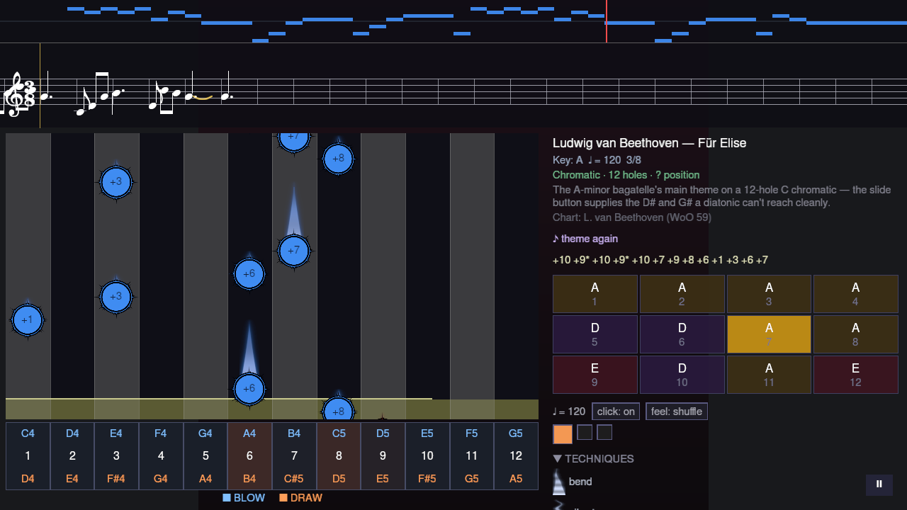
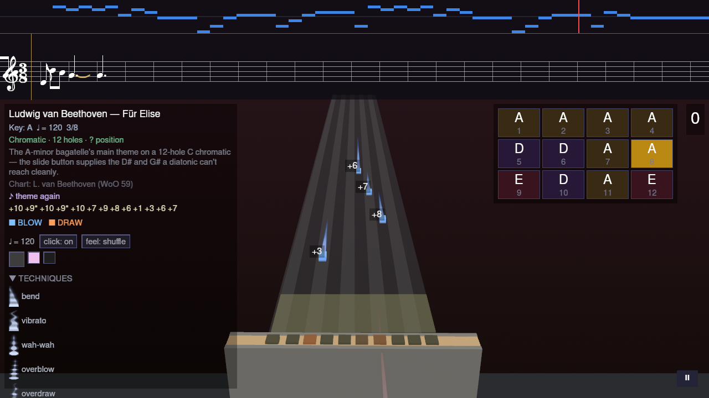
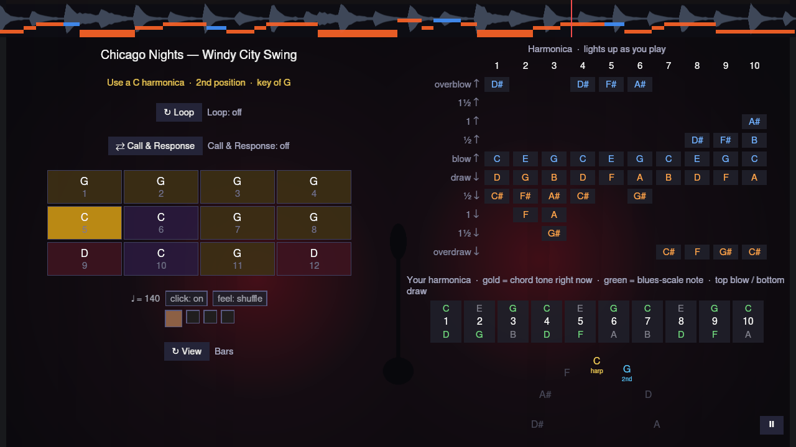
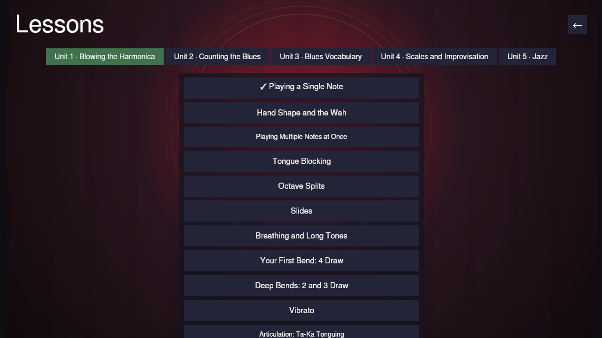

+++
title = "Harmonicon: a rhythm game you play on a real harmonica"
date = 2026-08-31

[taxonomies]
tags=["rust", "bevy", "music", "harmonica", "gamedev", "kde"]
categories=["harmonicon", "kde"]
+++

For once, something on this blog that isn't C++.

Harmonicon is a rhythm game for blues harmonica. Notes scroll toward a hit line
and you play on an actual harmonica, into your microphone, and the game listens.

## The idea

The harmonica is cheap, fits in a pocket, and it hides everything:
the reeds are inside, your tongue and throat do most of the work, 
and nothing about the instrument tells you whether the note that just 
came out is the note you meant. You can practise a bend wrong for a
month quite happily.

Let the instrument be the input. Harmonicon captures the microphone, runs pitch 
detection on it in real time, and scores what you actually played against the chart.
Every note you score is a note you genuinely hit.

## Playing a song

The default view is one lane per hole: ten for a diatonic, twelve for a
chromatic, taken from whatever the chart was written for. Blue notes are blows,
orange are draws, and the number on each is the hole you need. Above the lanes
there's the phrase in standard notation and as harmonica tab, because those are
the two ways harmonica players actually read music, and the panel on the right
tells you which harp to pick up and which position you're playing in.

There's also a 3D view, which is the same game rendered around a harmonica model
that moves with the beat.

<!-- more -->
## Getting away from charts

Charts are good for learning a song and bad for learning to play. The Jam
Session mode drops the scoring entirely and gives you a rolling 12-bar blues to
improvise over.

The useful part is the hole map on the right. As the backing moves through the
bars, each hole recolours: gold if it's a chord tone of the bar sounding right
now, green if it's elsewhere in the blues scale, dim if it's going to sound
wrong. You follow the colour instead of trying to recall theory at tempo, and
the theory arrives later, on its own.

## Lessons

There's a curriculum underneath all of this, grouped into units and gated by
prerequisites — from getting one clean single note out of the thing, through
bends and articulation, up to improvising over a blues. Some lessons are scored
drills. A few aren't scoreable at all: tongue blocking sounds identical to
puckering from the microphone's point of view, so that one is instruction you
mark as done and the game trusts you.

## Under the hood

Rust, with [Bevy](https://bevyengine.org/) for the engine and `cpal` for audio
capture. The interesting problem is the pitch detection, which is why there are
five algorithms to chose from: FFT, YIN, pYIN, MPM and NMF.

## Status

There's a lot in it — a bending
trainer, an in-game song editor with MIDI import, adaptive difficulty, A–B
looping, latency calibration, a spectrogram — but "early/experimental" is an
honest label rather than modesty.

It's MIT licensed and the code is at
[github.com/tcanabrava/harmonicon](https://github.com/tcanabrava/harmonicon).
If you own a harmonica and a microphone, that's the entire hardware requirement.
